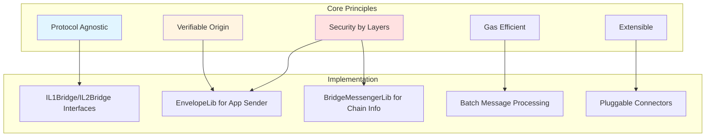
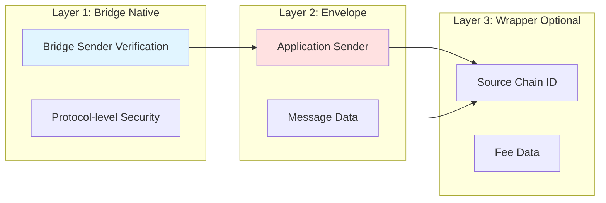
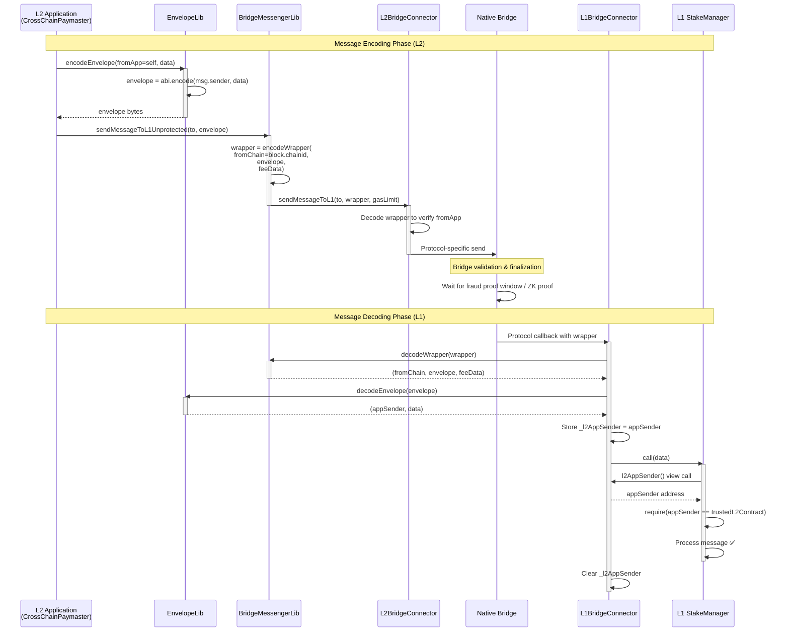
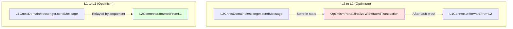
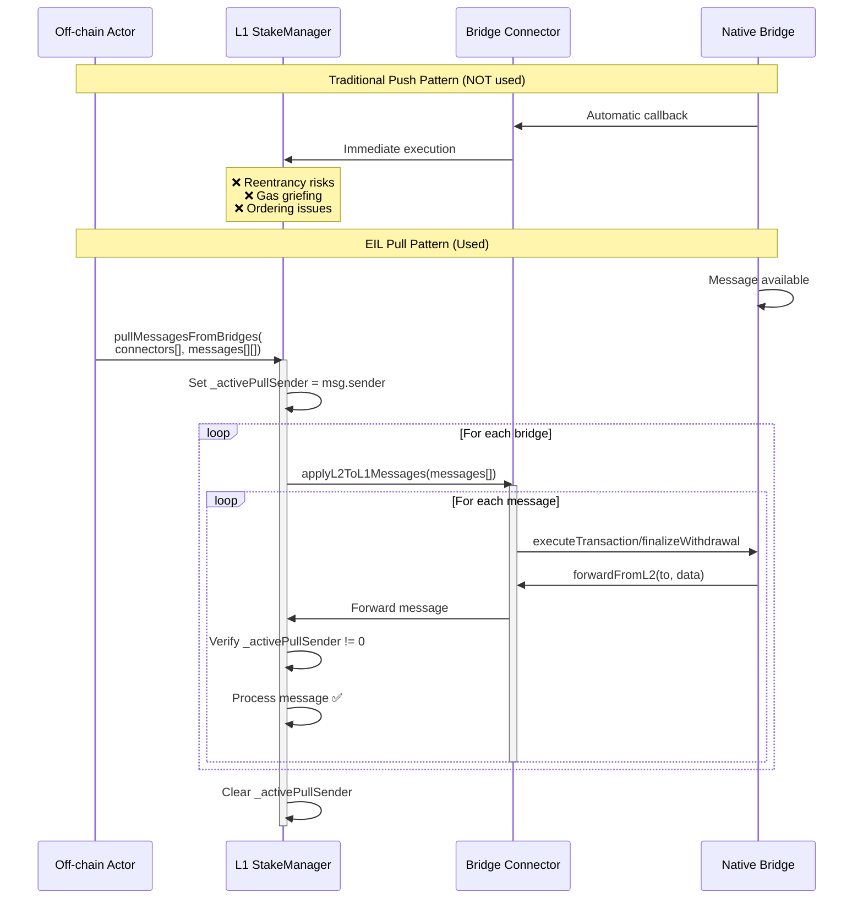
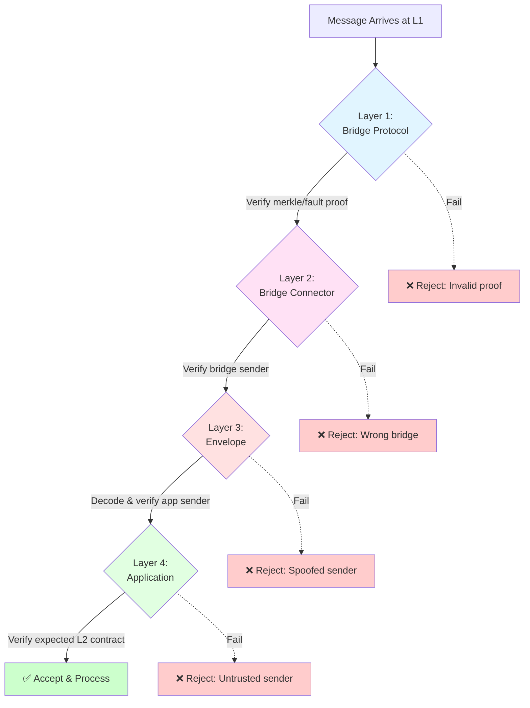
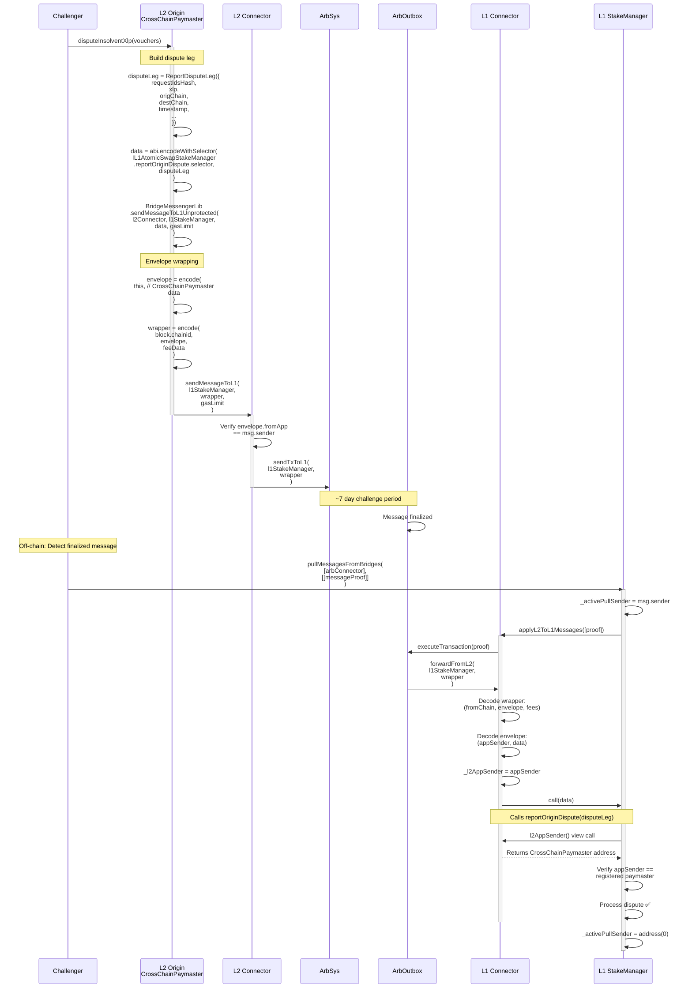
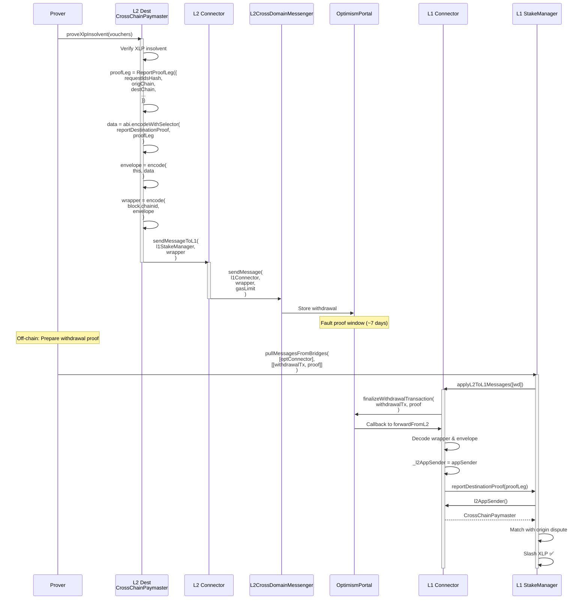

# EIL Bridge Patterns - Deep Dive Analysis

## Overview

This document provides an in-depth analysis of the bridge patterns used in the Ethereum Interoperability Layer (EIL) protocol, focusing on how cross-chain communication is secured and implemented.

---

## Table of Contents

1. [Bridge Architecture Philosophy](#bridge-architecture-philosophy)
2. [Envelope Pattern](#envelope-pattern)
3. [Bridge Connector Implementations](#bridge-connector-implementations)
4. [Pull vs Push Messaging](#pull-vs-push-messaging)
5. [Security Model](#security-model)
6. [Message Flow Examples](#message-flow-examples)

---

## Bridge Architecture Philosophy

### Design Principles



### Why Not Direct Bridge Usage?

| Challenge | EIL Solution |
|-----------|--------------|
| Each bridge has different APIs | Unified `IL1Bridge`/`IL2Bridge` interfaces |
| Bridge only provides contract sender, not original app | **Envelope pattern** adds app-level sender |
| Different message formats (Arbitrum vs Optimism) | Abstracted in connector implementations |
| Need to verify message authenticity | Multi-layer verification (bridge + envelope + application) |
| Gas efficiency for batch operations | Pull-based message processing |

---

## Envelope Pattern

### The Problem

Native bridges (Arbitrum, Optimism, etc.) only provide the **immediate sender** address, not the originating application:

```solidity
// What native bridges give you:
address l2Sender = bridge.l2ToL1Sender(); // Returns the L2 bridge contract address

// What EIL needs:
address appSender = ???; // Which L2 contract actually initiated this?
```

### The Solution: Two-Layer Envelope



### EnvelopeLib Implementation

```solidity
// ENCODING ON L2 (before sending)
bytes memory envelope = EnvelopeLib.encodeEnvelope(
    msg.sender,  // Application contract address on L2
    actualData   // The real message payload
);

// DECODING ON L1 (after receiving)
(address appSender, bytes memory data) = EnvelopeLib.decodeEnvelope(envelope);

// L1 can now verify:
require(appSender == expectedL2Contract, "Wrong app sender");
```

### Detailed Envelope Flow



### Code Example: Full Flow

```solidity
// ============================================
// ON L2 ORIGIN CHAIN (OriginationSwapDisputeManager.sol)
// ============================================

function _initiateDisputeWithBond(...) internal {
    // ... dispute validation ...
    
    // 1. Prepare the message data
    bytes memory messageData = abi.encodeWithSelector(
        IL1AtomicSwapStakeManager.reportOriginDispute.selector,
        disputeLeg
    );
    
    // 2. Send via BridgeMessengerLib
    BridgeMessengerLib.sendMessageToL1Unprotected(
        l2Connector,
        l1StakeManager,  // L1 target
        messageData,     // Will be wrapped in envelope
        L1_DISPUTE_GAS_LIMIT
    );
}

// ============================================
// BridgeMessengerLib.sol
// ============================================

function sendMessageToL1Unprotected(
    IL2Bridge connector,
    address to,
    bytes memory data,
    uint256 gasLimit
) internal {
    // 1. Create envelope with app sender
    bytes memory envelope = EnvelopeLib.encodeEnvelope(
        address(this),  // msg.sender = OriginationSwapDisputeManager
        data
    );
    
    // 2. Create wrapper with chain info
    bytes memory wrapper = EnvelopeLib.encodeWrapper(
        block.chainid,  // Source chain
        envelope,
        new bytes(0)    // No fee data
    );
    
    // 3. Send to connector
    connector.sendMessageToL1(to, wrapper, gasLimit);
}

// ============================================
// ON L2 BRIDGE CONNECTOR (L2ArbitrumBridgeConnector.sol)
// ============================================

function sendMessageToL1(
    address _destination,
    bytes calldata _data,
    uint256 _gasLimit
) external override {
    // Decode wrapper to verify the envelope's fromApp matches msg.sender
    (, bytes memory envelope, ) = EnvelopeLib.decodeWrapper(_data);
    (address from, ) = EnvelopeLib.decodeEnvelope(envelope);
    require(from == msg.sender, "fromApp mismatch");
    
    // Send via Arbitrum native bridge
    ArbSys(address(100)).sendTxToL1(_destination, _data);
}

// ============================================
// ON L1 BRIDGE CONNECTOR (L1ArbitrumBridgeConnector.sol)
// ============================================

function forwardFromL2(address to, bytes calldata data) external {
    require(msg.sender == address(outbox), "not L2 bridge");
    
    // 1. Decode wrapper
    (uint256 fromChain, bytes memory envelope, ) = EnvelopeLib.decodeWrapper(data);
    
    // 2. Decode envelope to get app sender
    (address appSender, bytes memory inner) = EnvelopeLib.decodeEnvelope(envelope);
    
    // 3. Store app sender temporarily (transient storage pattern)
    address prev = _l2AppSender;
    _l2AppSender = appSender;
    
    // 4. Forward to L1 contract
    (bool success, bytes memory reason) = to.call(inner);
    
    // 5. Clear app sender
    _l2AppSender = prev;
    
    require(success, "L2->L1 forward failed");
}

// ============================================
// ON L1 STAKE MANAGER (L1AtomicSwapStakeManager.sol)
// ============================================

function reportOriginDispute(ReportDisputeLeg calldata disputeLeg) external {
    // Verify message came from trusted bridge
    require(_activePullSender != address(0), "Must use pull pattern");
    
    // Verify app sender is the expected L2 paymaster
    address l2Sender = IL1Bridge(msg.sender).l2AppSender();
    ChainInfo memory chainInfo = chainsInfos[disputeLeg.l1Xlp][disputeLeg.origChain];
    require(l2Sender == chainInfo.paymasterOnOriginChain, "Wrong L2 app sender");
    
    // Process dispute ✅
    _processOriginDispute(disputeLeg);
}
```

---

## Bridge Connector Implementations

### Arbitrum Pattern

```mermaid
graph TB
    subgraph "L2 to L1 (Arbitrum)"
        L2Send[ArbSys.sendTxToL1]
        L2Send -->|Store in outbox| ArbOutbox
        ArbOutbox -->|After challenge period| L1Execute
        L1Execute[ArbOutbox.executeTransaction]
        L1Execute -->|Verify merkle proof| Callback
        Callback[L1Connector.forwardFromL2]
    end

    subgraph "L1 to L2 (Arbitrum)"
        L1Send[ArbInbox.createRetryableTicket]
        L1Send -->|Sequencer picks up| L2Deliver
        L2Deliver[L2Connector.forwardFromL1]
    end

    style ArbOutbox fill:#ffe1e1
    style L2Deliver fill:#e1ffe1
```



**Key Characteristics:**
- **L2→L1**: Requires merkle proof execution after ~1 week challenge period
- **L1→L2**: Retryable tickets with gas prepayment
- **Message Format**: `(bytes32[] proof, uint256 index, address l2Sender, ...)`

### Optimism Pattern



**Key Characteristics:**
- **L2→L1**: Uses `WithdrawalTransaction` with fault proof system
- **L1→L2**: CrossDomainMessenger with automatic relaying
- **Message Format**: `(WithdrawalTransaction, bytes proof)`

### Comparison Table

| Aspect | Arbitrum | Optimism | EIL Abstraction |
|--------|----------|----------|-----------------|
| **L2→L1 Delay** | ~7 days | ~7 days (fault proof) | Transparent to app |
| **Proof System** | Merkle proof | Fault proof + withdrawal proof | Handled by connector |
| **Message Execution** | Manual via `executeTransaction` | Manual via `finalizeWithdrawalTransaction` | `applyL2ToL1Messages()` |
| **Sender Verification** | `outbox.l2ToL1Sender()` | `messenger.xDomainMessageSender()` | `connector.l2AppSender()` |
| **Gas Model** | Retryable tickets | Optimistic relaying | Specified in `gasLimit` param |
| **Envelope Support** | ✅ Yes | ✅ Yes | ✅ Required |

---

## Pull vs Push Messaging

### The Pull Pattern Used by EIL



### Why Pull Pattern?

| Concern | Push Pattern Risk | Pull Pattern Solution |
|---------|------------------|----------------------|
| **Reentrancy** | Attacker can reenter during callback | Single `_activePullSender` guard prevents nested calls |
| **Gas Griefing** | Malicious message consumes all gas | Caller controls gas per message batch |
| **Message Ordering** | Bridge controls order | Caller can batch & order messages optimally |
| **DoS via Revert** | Failed message blocks queue | Failed message just reverts single tx, doesn't block others |
| **Gas Cost Control** | Bridge charges unpredictable gas | Caller pays exactly what they consume |

### Pull Implementation Details

```solidity
// L1AtomicSwapStakeManager.sol

address private _activePullSender;

function pullMessagesFromBridges(
    IL1Bridge[] calldata bridgesConnectors,
    bytes[][] calldata bridgeMessagesPerBridge
) external {
    require(
        bridgesConnectors.length == bridgeMessagesPerBridge.length,
        "Length mismatch"
    );
    
    // Reentrancy guard
    require(_activePullSender == address(0), "Already pulling");
    _activePullSender = msg.sender;
    
    for (uint256 i = 0; i < bridgesConnectors.length; i++) {
        // Each connector validates and forwards messages
        bridgesConnectors[i].applyL2ToL1Messages(
            bridgeMessagesPerBridge[i]
        );
    }
    
    _activePullSender = address(0);
}

// Called by bridge connector during message execution
function reportOriginDispute(ReportDisputeLeg calldata disputeLeg) external {
    // CRITICAL: Only allow during pull operation
    require(
        _activePullSender != address(0),
        "Must use pull pattern"
    );
    
    // Verify message origin
    address l2AppSender = IL1Bridge(msg.sender).l2AppSender();
    // ... verification ...
    
    // Process message
    _processOriginDispute(disputeLeg);
}
```

---

## Security Model

### Multi-Layer Verification



### Attack Scenarios & Mitigations

#### Attack 1: Spoofed L2 Sender

**Attempt:**
```solidity
// Attacker creates malicious L2 contract
contract MaliciousL2 {
    function attack() external {
        // Try to send fake dispute message
        bytes memory fakeEnvelope = EnvelopeLib.encodeEnvelope(
            REAL_PAYMASTER_ADDRESS,  // Spoof the real paymaster!
            maliciousData
        );
        
        connector.sendMessageToL1(l1StakeManager, fakeEnvelope);
    }
}
```

**Mitigation:**
```solidity
// L2 Connector verifies envelope matches msg.sender
function sendMessageToL1(..., bytes calldata data, ...) external {
    (, bytes memory envelope, ) = EnvelopeLib.decodeWrapper(data);
    (address fromApp, ) = EnvelopeLib.decodeEnvelope(envelope);
    
    require(fromApp == msg.sender, "Envelope sender mismatch");
    // ✅ Attacker's envelope claims to be from REAL_PAYMASTER
    //    but msg.sender is MaliciousL2 → REJECTED
}
```

#### Attack 2: Fake Bridge Message

**Attempt:**
```solidity
// Attacker calls L1 directly, bypassing bridge
l1Connector.forwardFromL2(l1StakeManager, fakeData);
```

**Mitigation:**
```solidity
// L1 Connector only accepts from real bridge
function forwardFromL2(address to, bytes calldata data) external {
    require(
        msg.sender == address(outbox),  // or portal, etc.
        "Only bridge can call this"
    );
    // ✅ Direct calls rejected
}
```

#### Attack 3: Message Replay

**Attempt:**
```solidity
// Attacker tries to replay old dispute message
connector.applyL2ToL1Messages([oldMessage, oldMessage, oldMessage]);
```

**Mitigation:**
```solidity
// Native bridges prevent replay via:
// - Arbitrum: Merkle proof can only be executed once
// - Optimism: WithdrawalTransaction has unique nonce

// Application layer adds:
// - Request nonces
// - Dispute state tracking (can't dispute twice)
```

#### Attack 4: Reentrancy During Pull

**Attempt:**
```solidity
// Malicious bridge connector
function applyL2ToL1Messages(bytes[] calldata messages) external {
    // Try to reenter pullMessagesFromBridges
    L1StakeManager(msg.sender).pullMessagesFromBridges(...);
}
```

**Mitigation:**
```solidity
function pullMessagesFromBridges(...) external {
    require(_activePullSender == address(0), "Reentrancy detected");
    _activePullSender = msg.sender;
    // ... process ...
    _activePullSender = address(0);
}

function reportOriginDispute(...) external {
    require(_activePullSender != address(0), "Must use pull");
    // ✅ Any direct call is rejected
}
```

---

## Message Flow Examples

### Example 1: Origin Dispute Message



### Example 2: Destination Proof Message (Optimism)



---

## Best Practices for Backend Engineers

### 1. Monitoring Bridge Messages

```javascript
// Off-chain service pseudocode

class BridgeMessageMonitor {
  async monitorL2Messages(chainId) {
    // Watch for dispute/proof messages sent to L1
    const filter = paymaster.filters.DisputeInitiated();
    
    paymaster.on(filter, async (event) => {
      const { disputeId, requestIds } = event.args;
      
      // Store message details
      await db.storePendingL2ToL1Message({
        disputeId,
        requestIds,
        sentAt: event.blockNumber,
        chainId,
        status: 'SENT_TO_BRIDGE'
      });
      
      // Start monitoring for finalization
      this.trackMessageFinalization(chainId, disputeId);
    });
  }
  
  async trackMessageFinalization(chainId, disputeId) {
    // For Arbitrum: monitor outbox events
    // For Optimism: monitor portal events
    
    if (chainId === ARBITRUM_CHAIN_ID) {
      // Wait for OutBoxTransactionExecuted event
      const arbOutbox = new Contract(...);
      arbOutbox.on('OutBoxTransactionExecuted', async (event) => {
        // Check if this is our message
        const messageHash = computeMessageHash(disputeId);
        if (event.args.transactionHash === messageHash) {
          await this.executeL1Pull(chainId, disputeId);
        }
      });
    }
  }
  
  async executeL1Pull(chainId, disputeId) {
    // Prepare bridge message proof
    const proof = await getBridgeProof(chainId, disputeId);
    
    // Call pullMessagesFromBridges
    const tx = await l1StakeManager.pullMessagesFromBridges(
      [getBridgeConnector(chainId)],
      [[proof]]
    );
    
    await db.updateMessage(disputeId, {
      status: 'FINALIZED',
      l1TxHash: tx.hash
    });
  }
}
```

### 2. Testing Bridge Integration

```solidity
// Test helper for simulating cross-chain messages

contract BridgeTestHelper {
    L1ArbitrumBridgeConnector public l1Connector;
    L2ArbitrumBridgeConnector public l2Connector;
    
    // Simulate L2→L1 message in tests
    function simulateL2ToL1Message(
        address from,
        address to,
        bytes memory data
    ) external {
        // 1. Encode as L2 would
        bytes memory envelope = EnvelopeLib.encodeEnvelope(from, data);
        bytes memory wrapper = EnvelopeLib.encodeWrapper(
            L2_CHAIN_ID,
            envelope,
            ""
        );
        
        // 2. Mock bridge call
        vm.prank(address(l1Connector.outbox()));
        l1Connector.forwardFromL2(to, wrapper, 1000000);
    }
    
    // Verify envelope structure
    function assertValidEnvelope(
        bytes memory envelope,
        address expectedSender
    ) internal {
        (address sender, ) = EnvelopeLib.decodeEnvelope(envelope);
        assertEq(sender, expectedSender, "Wrong envelope sender");
    }
}
```

### 3. Gas Optimization Tips

```solidity
// ❌ BAD: Sending messages one at a time
for (uint i = 0; i < disputes.length; i++) {
    sendMessageToL1(disputes[i]);
}

// ✅ GOOD: Batch messages when possible
bytes[] memory messageData = new bytes[](disputes.length);
for (uint i = 0; i < disputes.length; i++) {
    messageData[i] = encodeDispute(disputes[i]);
}
sendBatchToL1(messageData);

// ✅ GOOD: Use efficient encoding
// Instead of multiple abi.encode calls, structure data optimally
struct BatchDisputeData {
    bytes32[] requestIds;
    address[] xlps;
    uint256[] amounts;
}
// Single encode/decode instead of per-item
```

### 4. Security Checklist

- [ ] Always verify `l2AppSender()` matches expected contract
- [ ] Use `_activePullSender` guard for L1 message handlers
- [ ] Validate envelope structure before sending
- [ ] Check bridge connector is trusted
- [ ] Ensure messages can't be replayed (use nonces/states)
- [ ] Handle bridge finalization failures gracefully
- [ ] Monitor for bridge reorgs (especially on L2)
- [ ] Implement message expiry/timeout logic
- [ ] Test with actual bridge testnets, not just mocks
- [ ] Verify gas limits are sufficient for message execution

---

## Summary

The EIL bridge pattern implements:

1. **Envelope Pattern**: Two-layer wrapping (bridge + application) for sender verification
2. **Pull-Based Processing**: Secure batch message execution with reentrancy protection
3. **Protocol Agnostic**: Unified interface for Arbitrum, Optimism, and future bridges
4. **Defense in Depth**: Multiple verification layers (bridge proof → connector → envelope → application)
5. **Gas Efficient**: Batch processing and optimized encoding

**Key Takeaway for Engineers**: The envelope pattern solves the fundamental problem of authenticating the *originating application* across bridge protocols that only verify the *immediate sender*. Combined with pull-based message processing, this creates a secure, flexible foundation for cross-chain communication in EIL.
