# EIL (Ethereum Interoperability Layer) - Complete Architecture Analysis

## Table of Contents
1. [System Architecture Overview](#system-architecture-overview)
2. [Data Model](#data-model)
3. [Sequence Diagrams](#sequence-diagrams)
4. [Bridge Patterns](#bridge-patterns)
5. [Dispute Resolution Flows](#dispute-resolution-flows)
6. [Trust Model](#trust-model)

---

## System Architecture Overview

### High-Level Component Architecture

### Contract Hierarchy & Delegation Pattern

---

## Data Model

### Core Data Structures

### State Machine Diagram

---

## Sequence Diagrams

### 1. Happy Path: Cross-Chain Token Transfer

```mermaid
sequenceDiagram
    participant User
    participant Wallet
    participant OriginChain as Origin L2 (Arbitrum)<br/>CrossChainPaymaster
    participant XLP as XLP Off-chain
    participant DestChain as Dest L2 (Optimism)<br/>CrossChainPaymaster
    participant L1 as L1 StakeManager

    Note over User,L1: Setup Phase
    XLP->>L1: stake(chainIds, amounts)
    L1->>L1: Record stake per chain
    XLP->>OriginChain: registerXlp()
    XLP->>DestChain: depositLiquidity(tokens)

    Note over User,L1: Transaction Initiation
    User->>Wallet: Request: Transfer 100 USDC<br/>from Arbitrum to Optimism
    Wallet->>Wallet: Construct multi-chain UserOps
    
    Wallet->>OriginChain: UserOp.execute()<br/>calls lockUserDeposit(voucherRequest)
    activate OriginChain
    OriginChain->>OriginChain: Validate sender & nonce
    OriginChain->>OriginChain: Lock 100 USDC from user
    OriginChain->>OriginChain: Store metadata with status=NEW
    OriginChain-->>XLP: Event: VoucherRequestCreated
    deactivate OriginChain

    Note over XLP: Reverse Dutch Auction Competition
    XLP->>XLP: Calculate optimal fee based on feeRule
    XLP->>XLP: Sign voucher with commitment
    
    XLP->>OriginChain: issueVoucher(voucherRequest, voucher)
    activate OriginChain
    OriginChain->>OriginChain: Verify voucher signature
    OriginChain->>OriginChain: Update status=VOUCHER_ISSUED
    OriginChain->>OriginChain: Record XLP address & timestamp
    OriginChain-->>Wallet: Event: VoucherIssued
    deactivate OriginChain

    Wallet->>Wallet: Detect VoucherIssued event
    Wallet->>Wallet: Attach voucher to dest UserOp

    Wallet->>DestChain: UserOp with paymasterAndData<br/>(contains voucher)
    activate DestChain
    DestChain->>DestChain: _validatePaymasterUserOp()
    DestChain->>DestChain: Verify voucher signature
    DestChain->>DestChain: Check XLP has sufficient balance
    DestChain->>DestChain: Precharge gas from XLP
    DestChain->>User: Transfer 100 USDC to user
    DestChain->>DestChain: Status=SUCCESSFUL
    DestChain->>DestChain: _postOp(): Refund unused gas
    DestChain-->>XLP: Event: VoucherSpent
    deactivate DestChain

    Note over User,L1: Settlement Phase
    XLP->>OriginChain: redeemFulfilledVouchers(voucherIds)
    OriginChain->>OriginChain: Verify unlock delay passed
    OriginChain->>XLP: Transfer original 100 USDC + fees
    
    User->>User: ✅ Transaction Complete!
```

### 2. XLP Insolvency Dispute Flow

```mermaid
sequenceDiagram
    participant User
    participant Challenger as Honest XLP/User
    participant OriginL2 as Origin L2
    participant DestL2 as Dest L2
    participant L1Bridge as L1 Bridge
    participant L1SM as L1 StakeManager
    participant MaliciousXLP as Malicious XLP

    Note over User,MaliciousXLP: XLP Issues Voucher but Cannot Fulfill
    User->>OriginL2: lockUserDeposit(request)
    MaliciousXLP->>OriginL2: issueVoucher(voucher)
    OriginL2->>OriginL2: Status = VOUCHER_ISSUED
    
    User->>DestL2: Submit UserOp with voucher
    DestL2->>DestL2: withdrawFromVoucher()
    DestL2->>DestL2: Check XLP balance
    DestL2->>DestL2: ❌ Insufficient balance!
    DestL2->>User: Revert (voucher invalid)

    Note over Challenger,L1SM: Dispute Initiation on Destination
    Challenger->>DestL2: proveXlpInsolvent(<br/>voucherRequests[],<br/>vouchers[],<br/>chunkIndex, totalChunks)
    activate DestL2
    DestL2->>DestL2: Validate each voucher
    DestL2->>DestL2: Confirm XLP was insolvent
    DestL2->>DestL2: Build ReportProofLeg (destination)
    DestL2->>L1Bridge: sendMessageToL1(proofLeg)
    deactivate DestL2

    Note over Challenger,L1SM: Dispute Initiation on Origin
    Challenger->>OriginL2: disputeInsolventXlp(<br/>disputeVouchers[],<br/>chunkIndex, totalChunks)
    activate OriginL2
    OriginL2->>OriginL2: Require bond payment
    Challenger->>OriginL2: Pay bond (% of disputed amount)
    OriginL2->>OriginL2: Update status = DISPUTE
    OriginL2->>OriginL2: Build ReportDisputeLeg (origin)
    OriginL2->>L1Bridge: sendMessageToL1(disputeLeg)
    deactivate OriginL2

    Note over L1SM: Dispute Resolution on L1
    L1Bridge->>L1SM: reportDestinationProof(proofLeg)
    L1Bridge->>L1SM: reportOriginDispute(disputeLeg)
    
    activate L1SM
    L1SM->>L1SM: Match origin & destination legs
    L1SM->>L1SM: Validate timestamps (dest before origin)
    L1SM->>L1SM: Verify same requestIds
    L1SM->>L1SM: Calculate slash amount
    L1SM->>L1SM: Slash XLP stake
    L1SM->>L1SM: Distribute slashed funds:<br/>- Challenger (bond return + reward)<br/>- Affected users
    L1SM->>OriginL2: sendMessageToL2(slashOutput)
    L1SM->>DestL2: sendMessageToL2(slashOutput)
    deactivate L1SM

    OriginL2->>OriginL2: onXlpSlashedMessage()
    OriginL2->>OriginL2: Update status = PENALIZED
    OriginL2->>User: Refund locked funds

    DestL2->>DestL2: onXlpSlashedMessage()
    DestL2->>DestL2: Mark XLP as slashed

    User->>User: ✅ Funds recovered!
    Challenger->>Challenger: ✅ Reward received!
```

### 3. Voucher Override Dispute Flow

### 4. ERC-4337 Integration Flow

---

## Bridge Patterns

### Bridge Architecture Overview

### Envelope Pattern for Message Security

```mermaid
sequenceDiagram
    participant Sender as Origin Contract
    participant EnvelopeLib
    participant Wrapper as BridgeMessengerLib
    participant Bridge as Bridge Connector
    participant NativeBridge as Native Bridge Protocol
    participant L1 as L1 StakeManager
    
    Note over Sender,L1: L2 to L1 Message Flow
    
    Sender->>EnvelopeLib: encodeEnvelope(fromApp=self, data)
    EnvelopeLib->>EnvelopeLib: envelope = abi.encode(fromApp, data)
    EnvelopeLib-->>Sender: envelope
    
    Sender->>Wrapper: sendMessageToL1Unprotected(to, envelope)
    Wrapper->>Wrapper: wrapper = encodeWrapper(<br/>fromChain, envelope, feeData)
    Wrapper->>Bridge: sendMessageToL1(to, wrapper)
    
    Bridge->>Bridge: Decode wrapper, verify fromApp
    Bridge->>NativeBridge: Protocol-specific send
    
    Note over NativeBridge: Native bridge validates
    
    NativeBridge->>Bridge: forwardFromL2(to, wrapper)
    Bridge->>Bridge: Decode envelope, extract appSender
    Bridge->>Bridge: Store _l2AppSender temporarily
    Bridge->>L1: call(data)
    
    L1->>Bridge: l2AppSender() view call
    Bridge-->>L1: returns stored appSender
    L1->>L1: Verify appSender == expected contract
    L1->>L1: ✅ Process message securely
    
    Bridge->>Bridge: Clear _l2AppSender
    
    Note over Sender,L1: Security: Each layer adds verification<br/>Prevents spoofing of message origin
```

### Bridge Connector Comparison

| Feature | Arbitrum Connector | Optimism Connector | Purpose |
|---------|-------------------|-------------------|---------|
| **L1→L2** | `IArbInbox.createRetryableTicket()` | `IL1CrossDomainMessenger.sendMessage()` | Submit messages from L1 to L2 |
| **L2→L1** | `IArbOutbox.executeTransaction()` | `IOptimismPortal.finalizeWithdrawalTransaction()` | Finalize L2 messages on L1 |
| **Message Format** | `(bytes32[] proof, uint256 index, ...)` | `(WithdrawalTransaction, bytes proof)` | Protocol-specific encoding |
| **Sender Verification** | `outbox.l2ToL1Sender()` | `messenger.xDomainMessageSender()` | Get L2 sender address |
| **Envelope Pattern** | ✅ Yes | ✅ Yes | Add application-layer sender info |
| **Pull Pattern** | `applyL2ToL1Messages(bridgeMessages[])` | `applyL2ToL1Messages(bridgeMessages[])` | Batch process messages |

---

## Dispute Resolution Flows

### Dispute Type Decision Tree

### L1 Dispute Matching Logic

### Stake Management State Machine

---

## Trust Model

### Security Guarantees & Assumptions

```mermaid
graph TB
    subgraph "User Guarantees"
        U1[✅ Self-custody at all times]
        U2[✅ Funds locked on-chain, not with XLP]
        U3[✅ Can dispute & recover if XLP fails]
        U4[✅ No off-chain trust needed]
        U5[✅ Censorship resistant]
    end

    subgraph "XLP Incentives"
        X1[💰 Earn fees for liquidity]
        X2[⚡ Compete on speed & price]
        X3[🔒 Stake at risk if dishonest]
        X4[📊 Reputation matters]
    end

    subgraph "System Assumptions"
        S1[🔗 L1 ↔ L2 bridges are secure]
        S2[⏱️ Disputes can be raised within time limits]
        S3[💵 XLP stake covers liabilities]
        S4[👥 At least one honest challenger exists]
        S5[⛽ Gas costs reasonable for disputes]
    end

    subgraph "Attack Mitigations"
        A1[🛡️ Voucher Override: Require allowlist]
        A2[🛡️ Insolvency: Stake slashing]
        A3[🛡️ Front-running: Signature verification]
        A4[🛡️ Griefing: Dispute bonds]
        A5[🛡️ Spam: Gas costs & time locks]
    end

    U3 --> X3
    X3 --> S3
    S4 --> A2
    A4 --> S5

    style U1 fill:#ccffcc
    style U2 fill:#ccffcc
    style U3 fill:#ccffcc
    style X3 fill:#ffcccc
    style A2 fill:#ffcccc
```

### Attack Surface Analysis

| Attack Vector | Mitigation | Code Location |
|---------------|------------|---------------|
| **XLP issues voucher but doesn't fulfill** | Insolvency dispute → stake slashing | `DestinationSwapDisputeManager.proveXlpInsolvent()` |
| **XLP issues override voucher** | Allowlist check + override dispute | `OriginationSwapDisputeManager.disputeVoucherOverride()` |
| **XLP front-runs user's voucher** | Signature verification, user controls allowlist | `CrossChainPaymaster._validatePaymasterUserOp()` |
| **XLP claims unspent fees dishonestly** | Proof of spending on destination chain | `DestinationSwapDisputeManager.proveVoucherSpent()` |
| **Malicious user disputes valid voucher** | Dispute bond requirement, bond slashed if invalid | `OriginSwapBase._initiateDisputeWithBond()` |
| **Bridge message spoofing** | Envelope pattern with app sender verification | `EnvelopeLib.sol`, `L1Bridge.forwardFromL2()` |
| **Replay attacks** | Nonce tracking per user | `OriginSwapManager.lockUserDeposit()` |
| **Griefing via spam disputes** | Bond requirement + gas costs | All dispute functions |
| **XLP withdraw stake with pending liabilities** | Unstake delay + dispute window | `L1AtomicSwapStakeManager.requestUnstake()` |

---

## Advanced Patterns

### Gas Accounting Pattern

### Token Deposit Management

### Chunked Reporting for Large Disputes

```mermaid
sequenceDiagram
    participant Challenger
    participant OriginL2
    participant L1
    
    Note over Challenger,L1: Dispute 1000 vouchers (too large for 1 tx)
    
    Challenger->>Challenger: Split into chunks:<br/>Chunk 0: vouchers[0-99]<br/>Chunk 1: vouchers[100-199]<br/>...<br/>Chunk 9: vouchers[900-999]
    
    Challenger->>Challenger: Calculate committedRequestIdsHash<br/>= hash(all 1000 requestIds)
    
    loop For each chunk
        Challenger->>OriginL2: disputeInsolventXlp(<br/>chunk, chunkIndex,<br/>totalChunks=10,<br/>committedHash)
        
        activate OriginL2
        OriginL2->>OriginL2: Validate chunk vouchers
        OriginL2->>OriginL2: Accumulate requestIds
        OriginL2->>OriginL2: Increment receivedChunks
        
        alt Last chunk received
            OriginL2->>OriginL2: hash(accumulated) == committedHash?
            OriginL2->>OriginL2: ✅ Complete report
            OriginL2->>L1: Send dispute leg with all requestIds
        else More chunks expected
            OriginL2->>OriginL2: Wait for next chunk
        end
        deactivate OriginL2
    end
    
    Note over Challenger,L1: Security: Prevents partial/incomplete disputes<br/>Commitment ensures all chunks belong to same dispute
```

---

## Key Insights for Backend Engineers

### 1. **Off-chain XLP Service Requirements**
- **Event Monitoring**: Listen for `VoucherRequestCreated` events across all chains
- **Fee Calculation**: Implement reverse dutch auction logic based on `AtomicSwapFeeRule`
- **Signature Generation**: Sign vouchers with EIP-712 standard
- **Liquidity Management**: Track deposits across chains, rebalance as needed
- **Dispute Detection**: Monitor for insolvency, override attacks, false claims
- **Cross-chain Coordination**: Ensure sufficient stake on L1 covers all chains

### 2. **Critical Security Considerations**
- **Nonce Management**: User nonces prevent replay; XLP must track latest nonce
- **Time Windows**: 
  - Voucher expiration times
  - Dispute windows
  - Unstake delays
  - Unlock delays for redemption
- **Signature Verification**: Both user and XLP signatures must be validated
- **Allowlist Enforcement**: Only authorized XLPs can fulfill requests

### 3. **Gas Optimization Patterns**
- **Batch Processing**: Multiple vouchers in single transaction
- **Chunked Reporting**: Large dispute sets split to fit block gas limits
- **Pre-charge/Post-op**: ERC-4337 pattern for accurate gas accounting
- **Storage Optimization**: EnumerableMap for efficient XLP lookups

### 4. **Integration Points**
- **ERC-4337 Bundler**: Submit UserOps with paymaster data
- **Bridge Watchers**: Monitor L1↔L2 message finalization
- **Price Oracles**: Calculate optimal fees based on market conditions
- **Liquidity Providers**: API for XLPs to register, stake, deposit

### 5. **Testing Scenarios**
- Happy path: User → Origin → XLP → Destination → Success
- XLP insolvency during high demand
- Multiple XLPs competing for same request
- Override attack by malicious XLP
- Dispute resolution with L1 finalization
- Bridge message delays/reorgs
- Gas price volatility during execution

---

## Summary

The EIL protocol implements a sophisticated cross-chain swap system with:

1. **Trust-minimized design**: On-chain enforcement, no relayer trust
2. **Economic security**: XLP stake on L1 backs all commitments  
3. **Dispute resolution**: Three-way matching (origin dispute + destination proof + L1 arbitration)
4. **Bridge abstraction**: Pluggable connectors for Arbitrum, Optimism, etc.
5. **ERC-4337 integration**: Gasless UX via paymaster pattern
6. **Modular architecture**: Delegation pattern keeps contracts under size limit

**For backend engineers**, the key is understanding:
- Event-driven XLP services
- Multi-chain state synchronization  
- Cryptographic proof generation
- Economic incentive alignment
- Gas-efficient batch operations

This architecture enables seamless cross-L2 interactions while preserving Ethereum's core values of decentralization and user sovereignty.
